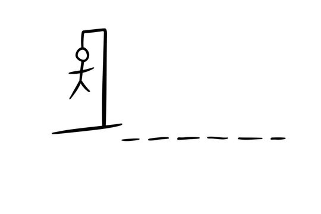

# __Hangman__

## __An AiCore Project__

### __What is Hangman?:__
 Hangman is a classic game in which a player thinks of a word and the other player tries to guess that word within a certain amount of attempts.

This look familiar?: 
 
 
### __What is this project?__
This is an implementation of the Hangman game, where the computer thinks of a word and the user tries to guess it. Not too unlike what you might remember playing when you were younger... just with the modern twist 

### __Aims of the project__
The primary goal of this project is to apply the knowledge and skills I've acquired during my studies with AiCore to create a comprehensive and practical project. No better way to see what you've learnt and to consolidate that learning, than making a fun game! 

### Installation:
To play this version of hangman, simply clone this repository. Once cloned you can then either run the file directly through your IDE pressing shift+enter or through the terminal by navigating to the project directory and running the script with python

like so:

    hangman/milestone_5.py  

### File Structure: 

1. assets: This directory contains an image related to the project.

2. hangman: This directory contains the main project files.

- milestone_2.py: Contains the code for milestone_2 of the project
- milestone_3.py: Contains the code for milestone_3 of the project
- milestone_4.py: Contains the code for milestone_4 of the project
- milestone_5.py: Contains the code for milestone_5 of the project and is the final implementation of the game.

__License Information:__

This project is released under the MIT License.

    MIT License

    Permission is hereby granted, free of charge, to any person obtaining a copy of this software and associated documentation files (the "Software"), to deal in the Software without restriction, including without limitation the rights to use, copy, modify, merge, publish, distribute, sublicense, and/or sell copies of the Software, and to permit persons to whom the Software is furnished to do so, subject to the following conditions:

    The above copyright notice and this permission notice shall be included in all copies or substantial portions of the Software.

    THE SOFTWARE IS PROVIDED "AS IS," WITHOUT WARRANTY OF ANY KIND, EXPRESS OR IMPLIED, INCLUDING BUT NOT LIMITED TO THE WARRANTIES OF MERCHANTABILITY, FITNESS FOR A PARTICULAR PURPOSE, AND NONINFRINGEMENT. IN NO EVENT SHALL THE AUTHORS OR COPYRIGHT HOLDERS BE LIABLE FOR ANY CLAIM, DAMAGES, OR OTHER LIABILITY, WHETHER IN AN ACTION OF CONTRACT, TORT, OR OTHERWISE, ARISING FROM, OUT OF, OR IN CONNECTION WITH THE SOFTWARE OR THE USE OR OTHER DEALINGS IN THE SOFTWARE.

